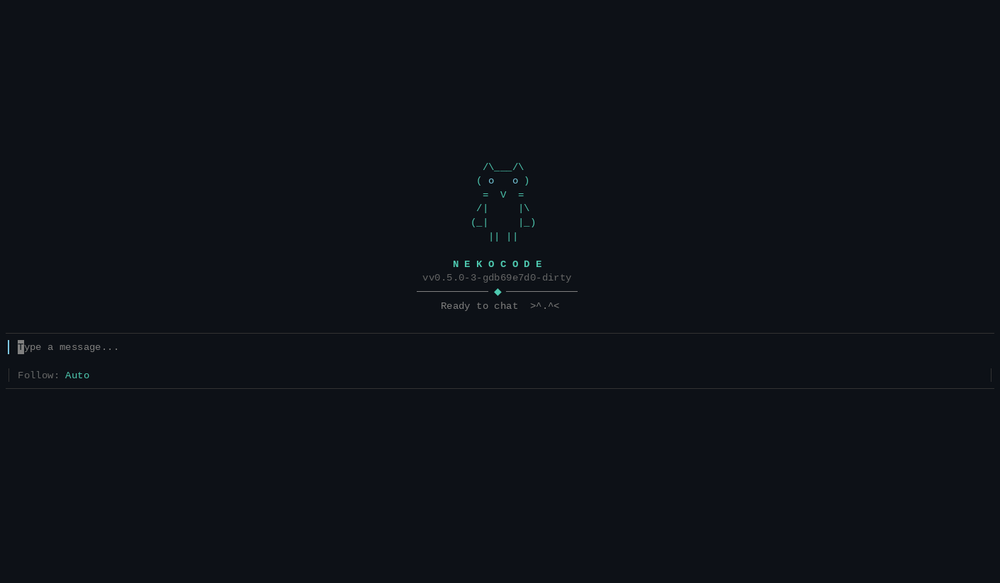

# NekoCode 🐱

<p align="center">
  <b>你的猫娘 AI 编程助手 &nbsp;·&nbsp; MIT 开源 &nbsp;·&nbsp; 一个文件就能跑</b>
</p>

<p align="center">
  <sub>双界面 · 多模型自由切换 · 读代码 / 改文件 / 跑命令，全靠聊</sub>
</p>

<p align="center">
  
</p>

---

## 这是什么？

NekoCode 是一个装在终端里的 **AI 编程助手**，把你的代码项目变成"能对话的同事"。

你不需要记命令行、不需要翻文档，**像聊天一样说出你的需求**，它就能帮你：

- 📖 **看懂项目** — 快速理解陌生代码库，讲清楚某段逻辑在干嘛
- ✏️ **改代码** — 加功能、修 bug、重构，改完自动检查格式和语法
- 🖥️ **跑命令** — 执行构建、测试等命令，替你盯着输出
- 🔍 **查资料** — 联网搜索、抓取网页，不懂的知识现查现用
- 🎨 **生成图片** — 需要示意图、封面图，直接让 AI 画一张

不锁死任何一家大模型：Anthropic、DeepSeek、Kimi、GLM 等，只要是 OpenAI 或 Anthropic 兼容接口都能用，聊天里 `/model` 随时切换。还能连接 Telegram / 飞书 / QQ，在手机上远程派任务。

## 为什么选 NekoCode？

- 📱 **手机上也能干活** — 连接 Telegram / 飞书 / QQ，不在电脑前也能派任务、收结果、点按钮批审批
- 🧹 **上下文干净** — 不乱往对话里塞数据：技能按需加载、记忆由你手写维护，token 花在刀刃上，不为杂物买单
- 📦 **一个文件，零负担** — 单二进制零依赖；不用注册、没有账号体系，API Key 是你自己的，数据不经过任何第三方
- 🧩 **兼容 Claude Code 生态** — 插件和技能格式与 Claude Code 兼容，现成的社区生态直接装，也可以只用 Skill 不装插件
- 🆓 **模型随便换** — 任意 OpenAI / Anthropic 兼容接口都能接入，`/model` 秒切，不被任何一家绑定

---

## 快速开始

### 第一步：一键安装

```bash
curl -fsSL https://raw.githubusercontent.com/lznauy/NekoCode/master/scripts/install.sh | sh
```

脚本自动识别系统（Linux / macOS）和架构，安装到 `~/.local/bin`（无需 sudo)。

> 💡 想装特定版本？ `curl -fsSL ... | sh -s -- --version v0.5.0`
> 💡 想装到别的位置？ `curl -fsSL ... | sh -s -- --dir /你的/目录`
> 💡 Windows 用户：请通过 [WSL](https://learn.microsoft.com/windows/wsl/install) 运行

<details>
<summary>其他安装方式（手动下载 / 源码编译）</summary>

从 [Releases 页面](https://github.com/lznauy/NekoCode/releases) 下载对应平台的二进制，加执行权限直接运行。

或源码编译（需要 [Go 1.25.8+](https://go.dev/dl/)）：

```bash
git clone https://github.com/lznauy/NekoCode.git
cd NekoCode
go build -o nekocode-tui ./cmd/tui
```

</details>

### 第二步：填上模型 API Key（只填一次）

```bash
mkdir -p ~/.nekocode
cat > ~/.nekocode/config.json << 'EOF'
{
  "active": "deepseek",
  "models": [
    {
      "name": "deepseek",
      "provider": "deepseek",
      "api_key": "sk-你的Key写这里",
      "model": "deepseek-v4-flash",
      "base_url": "https://api.deepseek.com/v1",
      "protocol": "openai"
    }
  ]
}
EOF
```

### 第三步：开聊

```bash
nekocode-tui
```

输入需求回车即可。输入 `/` 弹出命令菜单；任务运行中按 `Esc` 停止；有风险的操作会弹出确认框等你批准。

> ✨ 想换模型？在 `models` 数组里加一个条目，聊天里输入 `/model 名字` 切换。

---

## 了解更多

- 📖 [用户使用指南](docs/USER_GUIDE.md) — 全部命令与快捷键、连接 Telegram / 飞书 / QQ、技能（Skill）与插件（Plugin)、MCP 配置、配置文件详解、权限与安全、常见问题
- 🖥️ 桌面窗口版（GUI）暂未随 Release 发布，需源码编译：`wails build`（需要 Node/npm 和 [Wails](https://wails.io/)）

## 开源

NekoCode 使用 **MIT 许可证**，完全开源，随意使用、修改、分发。

---

## 给开发者

- [USER_GUIDE.md](docs/USER_GUIDE.md) — 用户使用指南：命令、IM 连接、技能/插件/MCP、配置文件
- [ARCHITECTURE.md](docs/ARCHITECTURE.md) — 整体架构、Agent 循环、工具系统
- [RUNTIME_APP_GUIDE.md](docs/RUNTIME_APP_GUIDE.md) — 基于底座组装上层 AI 应用
- [RUNTIME_HTTP_API.md](docs/RUNTIME_HTTP_API.md) — Runtime HTTP/SSE 协议
